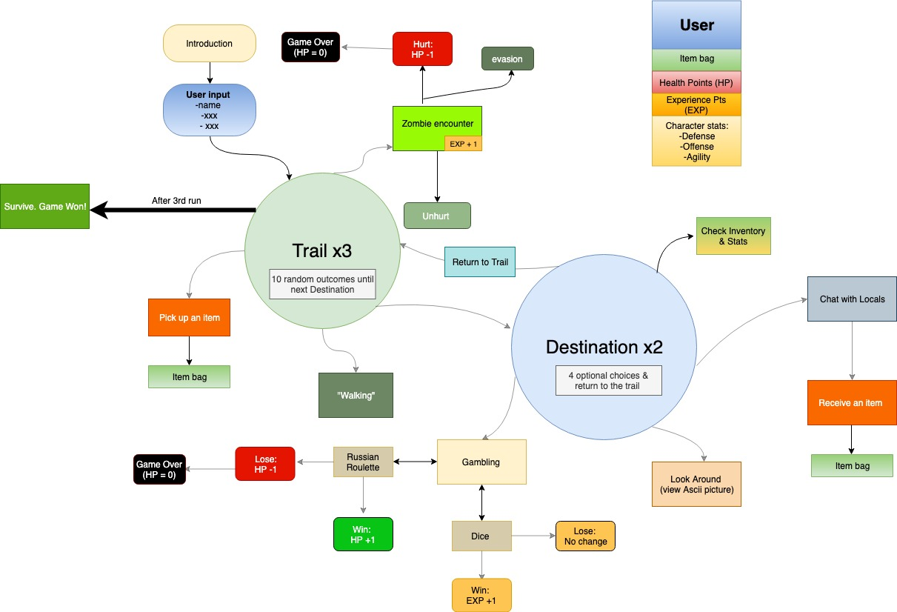
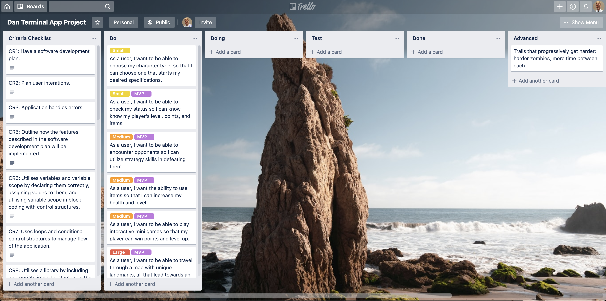

**Zombie Trail Ruby Terminal Application**

**Purpose & Scope**

*Description*

"Zombie Trail" is a basic linear role-playing game utilizing CLI (command line interface). It's purpose is to explore the different methods and learning objectives covered in the initial two weeks of the Coder Academy Fast-Track course, in the context of an adventure game.

The game-play follows a linear model where a player's survival, dependent on HP (health points), determines whether he/she wins the game. The player walks between destinations, between which  zombies are encountered and special items can be retrieved. 

*Use*

Development of the application is for the purpose of entertainment. Themes are satrical and draw from "zombie culture". Users utilize strategy skills to achieve the goal of survival in the game when confronted with different obsticals. The target audience for anyone interested in RPGs and zombies, young or old. 

*3 eatures*

1. Users will be able to "run" through a loop of random interactions which will include zombies (basic, large, and leaching), and item retrieval. This will follow through a while loop that will choose values from an array at random and output them to the screen. These outputs will have an effect on the HP and EXP instance variables of the player class. These values in turn will affect whether a player is still living or levels up, respectively. These values are held within an instance variable in the character class. 

2. Users can input choices once they reach intermediate destinations that consist of interacting with characters, viewing (ascii) images, or playing mini-games with boolean outcomes. Users can decide when to leave intermediate destinations and have control over any given actions within each destination. The interaction with characters will be taken from a hash that will display values, including the players dialogue. Players will be able to increase their inventory based on items received from certain players, which will populate their array of items. The mini games will run through a loop (a very large loop that unfortunately is a bit unweildy but taught me a LOT of what not to do). The result of these games will have an affect on instance variables for the player class, which in turn can lead to "leveling up" certain values that increase gameplay ability. 

3. Users will be able to utilize items to aid in their goal of reaching the end of the game. Viewing one's stockpile of items, current "HP", and current "exp", will be displayed using methods within the specific player class. These values will be stored in an array and instance variables in the player class. 

*User Interaction and Experience* 

###

Players will be instructe

Develop an outline of the user interaction and experience for the application.
Your outline must include:
- how the user will find out how to interact with / use each feature
- how the user will interact with / use each feature
- how errors will be handled by the application and displayed to the user

*Flow Chart*

